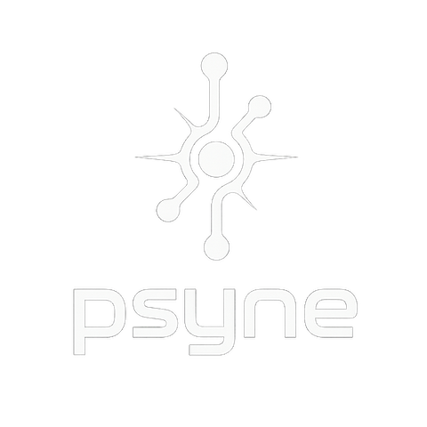

  
  
  **High-performance, zero-copy messaging library optimized for AI/ML applications**
  
  
  
  
  
  
  
  
  
  
  
  [🚀 Quick Start](#-quick-start) • [📖 Documentation](#-documentation) • [🛠️ Language Bindings](#️-language-bindings) • [⚡ Performance](#-performance) • [🤝 Contributing](#-contributing)

---

Psyne provides ultra-low latency inter-process communication with support for multiple transport protocols and comprehensive language bindings.

