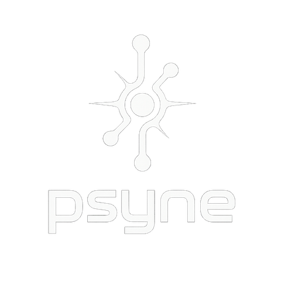

# Psyne Documentation

  

Welcome to the Psyne documentation! This comprehensive guide will help you get started with Psyne, understand its architecture, and make the most of its high-performance messaging capabilities.

## 📚 Documentation Structure

### 🚀 Getting Started
- **[Overview](overview.md)** - Introduction to Psyne and its core concepts
- **[Getting Started Guide](getting-started.md)** - Step-by-step tutorial for first-time users
- **[Installation & Setup](../README.md#-installation)** - Build instructions and dependencies

### 📖 Core Concepts
- **[Channels](channels.md)** - Understanding different transport types and channel modes
- **[Message Types](tutorials/02-message-types.md)** - Built-in and custom message types
- **[Architecture](../README.md#️-architecture)** - System design and zero-copy principles

### 🎓 Tutorials (Step-by-Step)
1. **[Getting Started](tutorials/01-getting-started.md)** - Your first Psyne application
2. **[Message Types](tutorials/02-message-types.md)** - Working with different data types
3. **[Inter-Process Communication](tutorials/03-inter-process-communication.md)** - Cross-process messaging
4. **[Network Channels](tutorials/04-network-channels.md)** - TCP, UDP, and WebSocket communication
5. **[Performance Optimization](tutorials/05-performance-optimization.md)** - Tuning for maximum performance

### ⚡ Performance & Optimization
- **[Performance Guide](performance.md)** - Benchmarks and performance characteristics
- **[Performance Tuning](performance-tuning.md)** - Optimization techniques and best practices
- **[Unix Sockets](unix_sockets.md)** - High-performance local communication

### 📋 Reference
- **[API Reference](api-reference.md)** - Complete API documentation
- **[Language Bindings](../bindings/)** - Language-specific guides
  - [Python](../bindings/python/README.md)
  - [JavaScript/TypeScript](../bindings/javascript/README.md)
  - [Rust](../bindings/rust/README.md)
  - [Go](../bindings/go/README.md)
  - [Java](../bindings/java/README.md)
  - [C#](../bindings/csharp/README.md)
  - [Swift](../bindings/swift/README.md)
  - [Julia](../bindings/julia/README.md)

### 🔧 Advanced Topics
- **Compression & Encryption** - Data compression and security features
- **Reliability Features** - Acknowledgments, retries, and fault tolerance
- **Distributed Tracing** - Observability and debugging
- **GPU Integration** - High-performance computing with GPU support

### 💡 Examples
- **[Basic Examples](../examples/)** - 37+ real-world usage examples
- **[Benchmarks](../benchmarks/)** - Performance testing and measurement tools

## 🗺️ Quick Navigation

### For Beginners
Start here if you're new to Psyne:
1. Read the [Overview](overview.md)
2. Follow the [Getting Started Guide](getting-started.md)
3. Try the [first tutorial](tutorials/01-getting-started.md)
4. Explore [examples](../examples/)

### For Developers
Jump to specific topics:
- **API Integration**: [API Reference](api-reference.md)
- **Performance**: [Performance Guide](performance.md)
- **Language Bindings**: [Bindings Directory](../bindings/)
- **Advanced Features**: [Channels](channels.md)

### For System Architects
Focus on design and optimization:
- **Architecture**: [System Design](../README.md#️-architecture)
- **Performance Tuning**: [Optimization Guide](performance-tuning.md)
- **Transport Selection**: [Channels](channels.md)

## 📝 Documentation Guidelines

This documentation follows these principles:
- **Progressive Disclosure**: Start simple, add complexity gradually
- **Practical Examples**: Every concept includes working code
- **Multiple Formats**: API reference, tutorials, and examples
- **Cross-Referenced**: Easy navigation between related topics

## 🤝 Contributing to Documentation

Found an error or want to improve the docs?
- **Issues**: Report documentation bugs on [GitHub Issues](https://github.com/joshmorgan1000/psyne/issues)
- **Pull Requests**: Submit improvements via pull requests
- **Discussions**: Ask questions on [GitHub Discussions](https://github.com/joshmorgan1000/psyne/discussions)

## 📞 Need Help?

- **🐛 Bugs**: [GitHub Issues](https://github.com/joshmorgan1000/psyne/issues)
- **💬 Questions**: [GitHub Discussions](https://github.com/joshmorgan1000/psyne/discussions)
- **📧 Support**: support@psyne.io

---

**Happy coding with Psyne!** 🚀